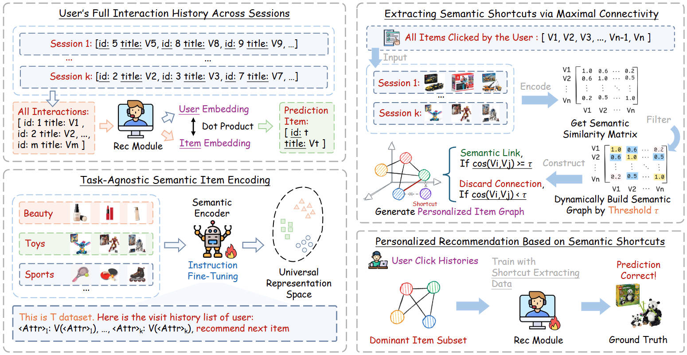

<div align="center">

<h1>LISRec: Modeling User Preferences with Learned Item Shortcuts for Sequential Recommendation
</h1>

<h5 align="center">
<a href='https://arxiv.org/abs/2505.22130'></a>
<a href='poster.pdf'></a>
<a href='https://huggingface.co/xhd0728/LISRec-MFilter'></a>

Haidong Xin<sup>1</sup>,
Zhenghao Liu<sup>1†</sup>,
Sen Mei<sup>2</sup>,
Yukun Yan<sup>2</sup>,
Shi Yu<sup>2</sup>,
Shuo Wang<sup>2</sup>,
Zulong Chen<sup>3</sup>,
Yu Gu<sup>1</sup>,
Ge Yu<sup>1</sup>,
Chenyan Xiong<sup>4</sup>

<sup>1</sup>Northeastern University, <sup>2</sup>Tsinghua University, <sup>3</sup>Alibaba Group, <sup>4</sup>Carnegie Mellon University

</h5>
</div>

## Introduction

LISRec addresses noisy interactions in sequential recommendation by constructing a personalized item graph over each user's interaction history. It uses similarities between text-based item representations to extract the largest connected component, retaining stable preferences while filtering noisy interactions. LISRec generalizes to both item ID-based and text-based recommendation models.



## Requirements

### 1. Python environment

The pinned dependencies target Python 3.8 or 3.9. Create an isolated environment, then install the requirements:

```shell
python -m pip install --upgrade pip
python -m pip install -r requirements.txt
```

### 2. Install OpenMatch

Refer to [https://github.com/OpenMatch/OpenMatch](https://github.com/OpenMatch/OpenMatch) for detailed instructions.

```bash
git clone https://github.com/OpenMatch/OpenMatch.git
cd OpenMatch
python -m pip install -e .
cd ..
```

### 3. Pretrained T5 weights

The scripts use `google-t5/t5-base`; Transformers downloads and caches the weights automatically on first use.

## Reproduction guide

This section provides a step-by-step guide to reproduce the LISRec results.

> **Warning:** Model pretraining and fine-tuning require substantial GPU resources, and the embedding files require significant disk space.

### 1. Dataset preprocessing

We utilize the Amazon Product 2014 and Yelp 2020 datasets. Download the original data from:

- [Amazon Product 2014](https://jmcauley.ucsd.edu/data/amazon/index_2014.html)
- [Yelp 2020](https://business.yelp.com/data/resources/open-dataset/)

The following example uses the Amazon Beauty dataset.

#### 1.1. Download and prepare the Amazon Beauty dataset

```bash
mkdir -p data/raw/beauty
wget -c -P data/raw/beauty http://snap.stanford.edu/data/amazon/productGraph/categoryFiles/ratings_Beauty.csv
wget -c -P data/raw/beauty http://snap.stanford.edu/data/amazon/productGraph/categoryFiles/meta_Beauty.json.gz
```

#### 1.2. Unzip the metadata file

```bash
gzip -dk data/raw/beauty/meta_Beauty.json.gz
```

#### 1.3. Create the output directories

```bash
mkdir -p data dataset
```

#### 1.4. Convert the raw data to RecBole atomic files

```bash
bash scripts/process_origin.sh
```

#### 1.5. Extract the interaction and item tables used by LISRec

```bash
bash scripts/process_beauty.sh
```

### 2. Data preprocessing for training $\text{M}_{Filter}$

Before proceeding, process all four original datasets as described above to obtain the atomic files. Then, construct the mixed pretraining data for $\text{M}_{Filter}$ according to your desired proportions.

#### 2.1. Construct training, validation, and test data using RecBole

```bash
bash scripts/gen_pretrain_dataset.sh
```

#### 2.2. Tokenize item representations for $\text{M}_{Filter}$

```bash
bash scripts/gen_pretrain_items.sh
```

#### 2.3. Sample training data for $\text{M}_{Filter}$

For $\text{M}_{Filter}$ training data construction, we sampled the four datasets with balance. For each dataset, we selected the number of items corresponding to the dataset with the largest number of training samples and then randomly supplemented the datasets with insufficient training data:

```bash
python src/sample_train.py
```

#### 2.4. Sample validation data

Similarly, we selected the number of training samples from the dataset with the fewest training items in each case to serve as the validation set:

```bash
python src/sample_valid.py
```

#### 2.5. Construct pretraining data for sampled items

```bash
bash scripts/build_pretrain.sh
```

The included script shows the Beauty configuration. Repeat this step with the corresponding Sports, Toys, and Yelp paths before merging the four datasets.

#### 2.6. Merge training and validation data

```bash
python src/merge_json.py
```

### 3. Pretrain $\text{M}_{Filter}$

Pretrain the T5 model using next item prediction (NIP) and mask item prediction (MIP) tasks.

```bash
bash scripts/train_mfilter.sh
```

Adjust the training parameters for your GPU. Select the checkpoint with the lowest evaluation loss as the final $\text{M}_{Filter}$.

### 4. Generate embedding representations using $\text{M}_{Filter}$

Save the item embedding representations to avoid redundant calculations.

```bash
mkdir -p embedding
bash scripts/gen_embeddings.sh
```

### 5. Denoise the dataset using its largest connected component

Build an undirected item graph and use breadth-first search to extract its largest connected component.

```bash
bash scripts/build_graph.sh
```

Copy the original item information file to the denoised data folder.

```bash
mkdir -p dataset/beauty_filtered
cp dataset/Amazon_Beauty/Amazon_Beauty.item dataset/beauty_filtered/beauty_filtered.item
```

### 6. Build standardized training data for $\text{M}_{Rec}$ using RecBole

```bash
bash scripts/gen_dataset.sh
bash scripts/gen_train_items.sh
bash scripts/build_train.sh
```

### 7. Train $\text{M}_{Rec}$

```bash
bash scripts/train_mrec.sh
```

### 8. Evaluate $\text{M}_{Rec}$

```bash
bash scripts/eval_mrec.sh
```

### 9. Test $\text{M}_{Rec}$

```bash
bash scripts/test_mrec.sh
```

## Acknowledgement

- [OpenMatch](https://github.com/OpenMatch/OpenMatch): We utilize OpenMatch to reproduce the $\text{M}_{Rec}$ module.
- [RecBole](https://github.com/RUCAIBox/RecBole): We leverage RecBole for dataset processing and baseline reproduction.

## Citation

If you find this work useful, please cite our paper and consider starring this repository. 🌟

```bibtex
@inproceedings{xin2026lisrec,
    author = {Xin, Haidong and Liu, Zhenghao and Mei, Sen and Yan, Yukun and Yu, Shi and Wang, Shuo and Chen, Zulong and Gu, Yu and Yu, Ge and Xiong, Chenyan},
    title = {LISRec: Modeling User Preferences with Learned Item Shortcuts for Sequential Recommendation},
    year = {2026},
    url = {https://doi.org/10.1145/3770854.3780337},
    doi = {10.1145/3770854.3780337},
    booktitle = {Proceedings of the 32nd ACM SIGKDD Conference on Knowledge Discovery and Data Mining V.1},
    pages = {1650–1661},
    numpages = {12},
}
```

## Contact

For questions, suggestions, or bug reports, please contact:

```
xinhaidong@stumail.neu.edu.cn
```
